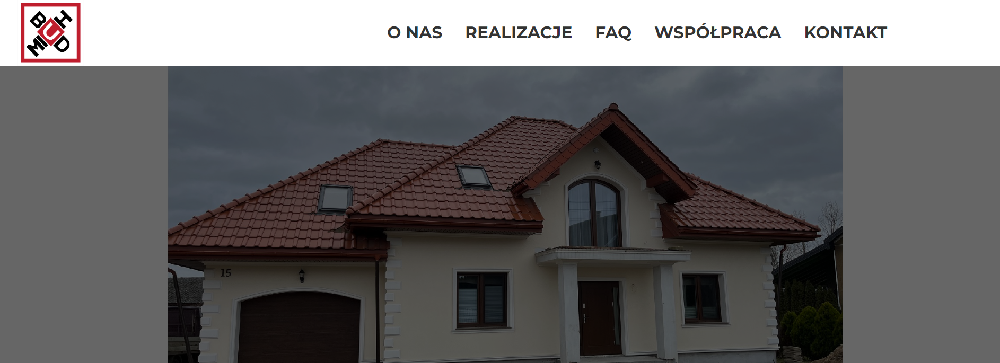
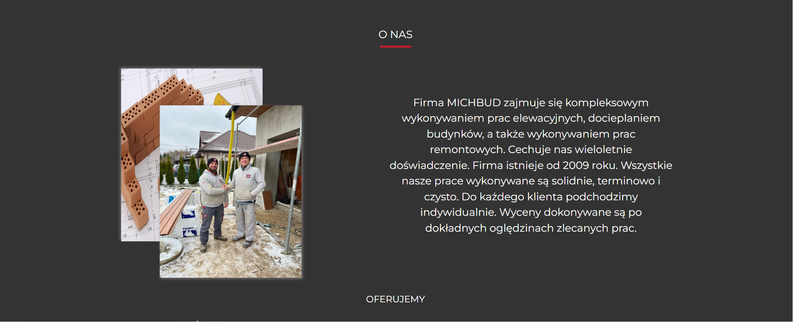
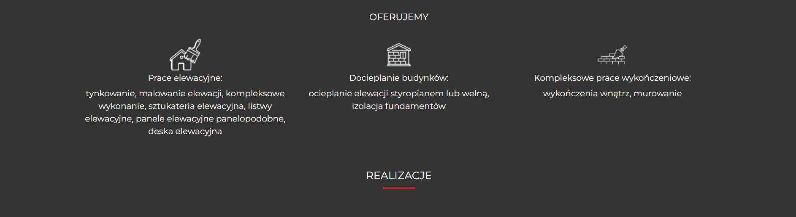
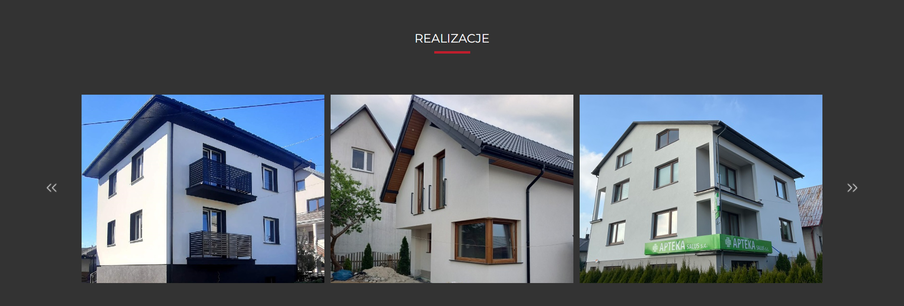
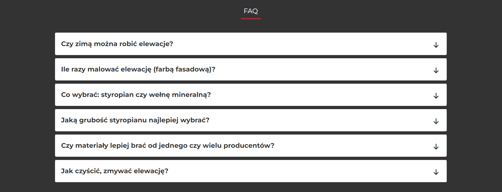
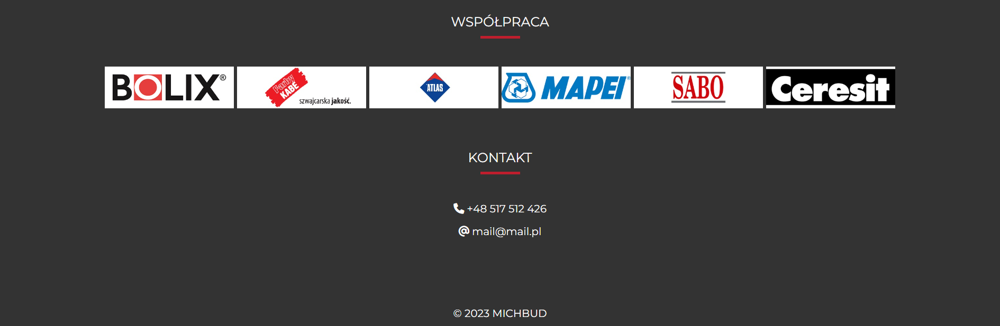

# strona-MICHBUD

MICHBUD construction company website.

Technologies :
- SASS
- Bootstrap
- Flexbox
- Java Script
- RWD

How to run project
1. git clone https://github.com/AnnaIdzkowska/MICHBUD-strona.git
2. npm install
3. gulp

